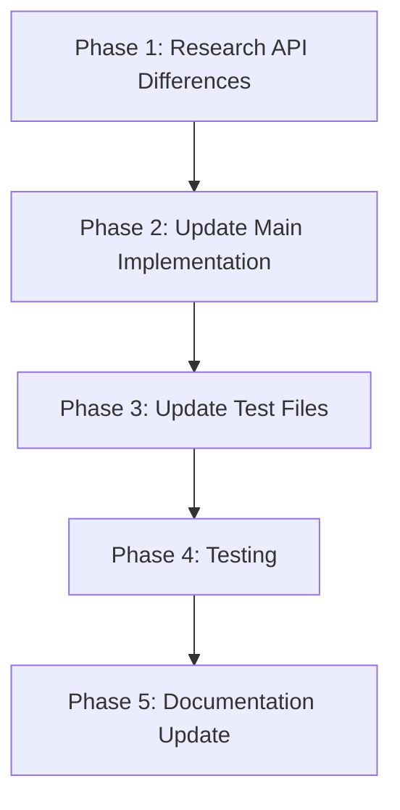

# Migration Plan: From signalprotocol-rs to Official libsignal

## Current Situation Analysis

Based on my examination of the TweetAI codebase, I've identified the following situation:

1. The project was originally using a crate called `signalprotocol-rs` for implementing the Signal Protocol for end-to-end encryption.
2. This crate doesn't appear to be available on crates.io, causing build failures.
3. The Cargo.toml file has been updated to use `libsignal-protocol = "0.1.0"`, but this is also outdated.
4. All the code (both tests and the main implementation) still imports from `signalprotocol_rs`.
5. The official Signal Protocol implementation is maintained by the Signal Foundation at https://github.com/signalapp/libsignal with the latest release being v0.71.0.

The migration requires updating both the main encryption service implementation and the test files to use the official `libsignal` crate.

## Files Requiring Updates

The following files need to be updated:

1. **Main Implementation**:
   - `tweetai/src/services/encryption.rs` - The core encryption service

2. **Test Files**:
   - `tweetai/src/bin/test_encryption.rs`
   - `tweetai/src/bin/test_tweetai_encryption.rs`
   - `tweetai/src/bin/test_encryption_security.rs`

## Migration Strategy

The migration will be performed in the following phases:



### Phase 1: Update Dependencies

First, we need to update the Cargo.toml file to use the official `libsignal` crate:

```toml
# Replace the current dependency
libsignal-protocol = "0.1.0"  # Signal Protocol implementation

# With the official libsignal crate
libsignal = { git = "https://github.com/signalapp/libsignal", tag = "v0.71.0" }
```

### Phase 2: Research API Differences

Before making any code changes, we need to understand the API differences between `signalprotocol-rs` and the official `libsignal` crate.

1. Review the documentation and examples in the official repository at https://github.com/signalapp/libsignal
2. Identify key differences in:
   - Module structure and imports
   - Class/struct names and methods
   - Function signatures and parameters
   - Error handling mechanisms
   - Serialization/deserialization approaches

### Phase 3: Update Main Implementation

Update the main encryption service implementation in `tweetai/src/services/encryption.rs`:

1. Change the import statements from `signalprotocol_rs` to `libsignal`
2. Update struct and method names according to the new API
3. Adjust function calls and parameters to match the new API
4. Update error handling to accommodate any differences in error types
5. Ensure serialization/deserialization is compatible with the new API
6. Implement proper key management and session setup according to the official documentation
7. Handle the Signal Protocol's X3DH and Double Ratchet algorithms correctly

### Phase 4: Update Test Files

Update each test file to use the new API:

1. `tweetai/src/bin/test_encryption.rs`
   - Update imports
   - Adjust test code to use the new API
   - Ensure all Signal Protocol operations are correctly implemented

2. `tweetai/src/bin/test_tweetai_encryption.rs`
   - Update imports
   - Adjust the `EncryptionService` struct implementation to use the new API
   - Update test code
   - Verify that the encryption/decryption flow works correctly

3. `tweetai/src/bin/test_encryption_security.rs`
   - Update imports
   - Adjust the `EncryptionService` struct implementation to use the new API
   - Update test code
   - Ensure all security properties are maintained

### Phase 5: Testing

After updating the code, thorough testing is required to ensure the encryption functionality works correctly:

1. Run each test file individually to verify they work with the new API
2. Test the main application to ensure the encryption service works correctly
3. Verify that encryption and decryption operations produce the expected results
4. Check for any performance differences between the old and new implementations
5. Ensure all security properties (Perfect Forward Secrecy, etc.) are maintained

### Phase 6: Documentation Update

Update documentation to reflect the changes:

1. Update `tweetai/docs/encryption_implementation_improvements.md` to reference the official `libsignal` crate
2. Add a note about the migration in `tweetai/docs/README.md`
3. Update security documentation to reflect the improved security from using the official implementation

## Potential Challenges and Mitigations

1. **API Incompatibility**:
   - Challenge: The API of the official `libsignal` crate will be significantly different
   - Mitigation: Create adapter functions/classes to bridge the gap between the old and new APIs

2. **Functionality Differences**:
   - Challenge: The official crate might organize functionality differently
   - Mitigation: Study the official examples and documentation thoroughly

3. **Performance Impact**:
   - Challenge: The official crate might have different performance characteristics
   - Mitigation: Conduct performance testing and optimize as needed

4. **Security Improvements**:
   - Opportunity: The official crate likely has better security properties
   - Action: Document and leverage these improved security features

## Key Security Benefits

Using the official `libsignal` crate provides several security advantages:

1. **Active Maintenance**: Regular updates and security patches from the Signal Foundation
2. **Proper Implementation**: Correctly implements the Signal Protocol specifications
3. **Community Support**: Backed by the Signal Foundation and community
4. **Audited Code**: More likely to have undergone security audits
5. **Latest Features**: Access to the latest security features and improvements

## Implementation Timeline

1. Phase 1 (Update Dependencies): 0.5 day
2. Phase 2 (Research): 1-2 days
3. Phase 3 (Main Implementation Update): 2-3 days
4. Phase 4 (Test Files Update): 2-3 days
5. Phase 5 (Testing): 2-3 days
6. Phase 6 (Documentation): 1 day

Total estimated time: 8-12 days

## Next Steps

1. Update the Cargo.toml file to use the official `libsignal` crate
2. Study the API documentation and examples of the official crate
3. Create a detailed mapping between the current implementation and the new API
4. Implement the changes in the main encryption service first
5. Update the test files one by one
6. Conduct thorough testing to ensure everything works correctly